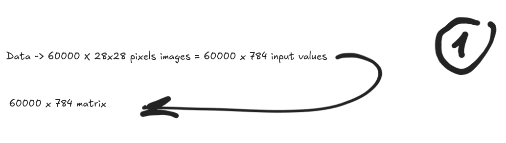
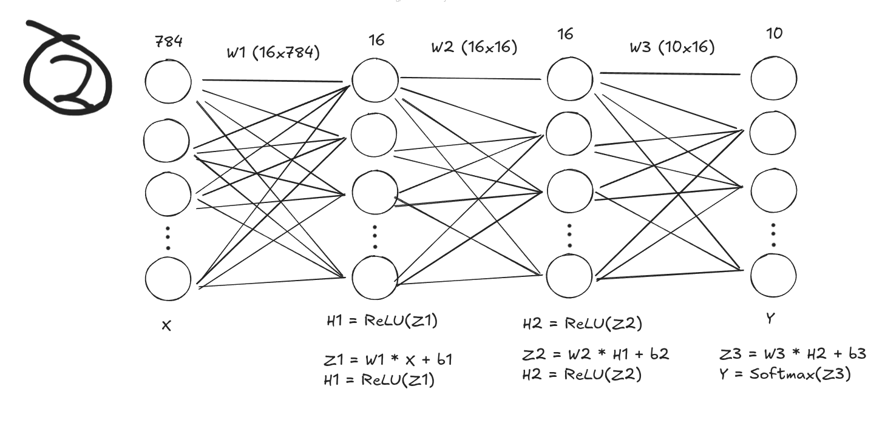
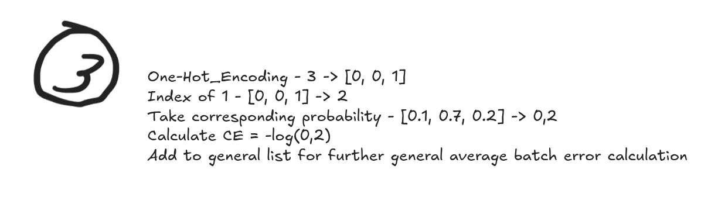
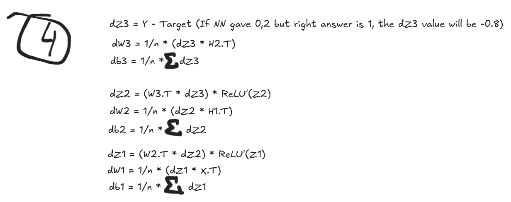
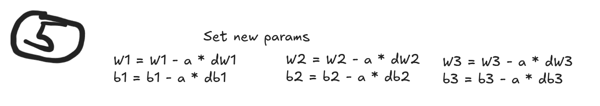
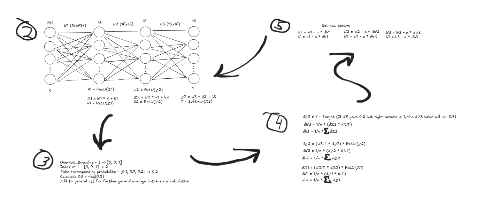

# Building neural network for handwritten objects recognition from scratch
## Stage 1. Data Preparation

Originally, MNIST dataset got 3-dimentional matrix for images (60000x28x28 for X_train, and 10000x28x28 for X_test data), its important to have it in 2-dimentional matrix for further operations

## Stage 2. Neural network architecture and Forward Propagation

## Stage 3. One-Hot_encoding and Cross-Entropy Loss

## Stage 4. Backward propagation

## Stage 5. Parameters configuration

## Stage 6. Repeat
